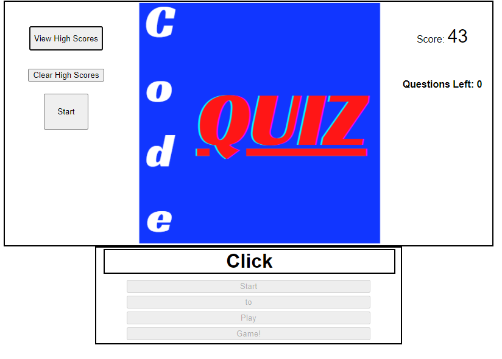
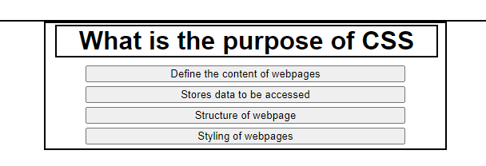
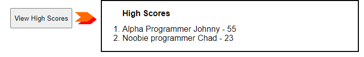
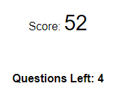
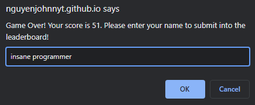

# Code Quiz Challenge
Take a coding quiz and obtain a score based on your time and correctness!

## Description
Test your coding knowledge in HTML, CSS, and JavaScript.  You have 60 seconds to answer five random questions.  For each incorrect answer, your timer will go down by five seconds.  Your score is only recorded if you have at least one correct answer and more than zero seconds on the clock remaining.  The score will be the amount of time remaining.  You may choose not to record a score or clear the leaderboard.

## Installation
Access via this [link](https://nguyenjohnnyt.github.io/CodeQuizChallenge/) (https://nguyenjohnnyt.github.io/CodeQuizChallenge/)

[Github repo](https://github.com/NguyenJohnnyT/CodeQuizChallenge)

## Usage
Initial startup:

Each question has four answers.  Choose the correct answer to move on to the next question:

Toggle the View High Score button outside of gameplay to see the leaderboard!

You can clear the high scores by pressing on the Clear High Scores button.

The score is recorded as the time left after completing all questions.  If the user obtains at least one correction correct and a score greater than zero, they will be able to record their score.

## Credit
[UCB Bootcamp](https://bootcampspot.com/)\
[w3schools html, css, js](https://www.w3schools.com/)\
[MDN web docks](https://developer.mozilla.org/en-US/docs/Web/JavaScript)\
[Shuffle function for arrays](https://stackoverflow.com/questions/2450954/how-to-randomize-shuffle-a-javascript-array)\
[Canva for Code Quiz logo](https://www.canva.com)